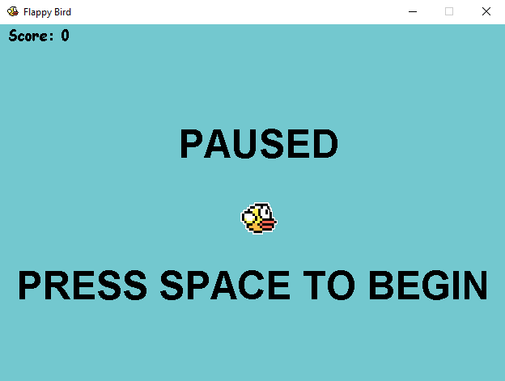
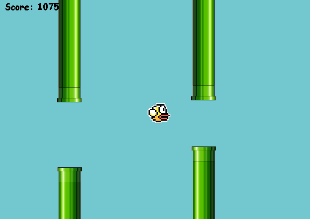

# 💻 Flappy Bird Game

That is an arcade-style game on which the player controls the bird Faby, which moves persistently to the right. The player navigates Fabi through pairs of pipes that have different sizes gaps placed at random heights.

## Gameplay

The game objective is to earn as many points as possible by controlling a bird without letting it crash into the pipes. If the bird touches an obstacle - or drops the bird - the game is over. The player earns points whenever the character passes through a pair of pipes.

## Images

The in-game pictures are below.

### Dashboard

### Game

---

## 👦🏻 Created by [Ruan Costa](https://costaruan.dev/)

